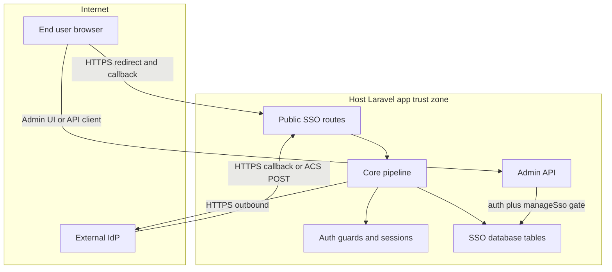

# Threat Model — `creativecrafts/laravel-sso`

**Date:** 2026-07-01  
**Scope:** Entire repository (`/Users/prince/Projects/CreativeCrafts/packages/laravel-sso`)  
**Validated context (user-confirmed):**
- **Deployment:** Library-only — no production deployment yet; model reflects typical integrator usage in a host Laravel app.
- **Admin UI:** Enabled with a **small trusted admin group** holding the `manageSso` gate.
- **Provisioning / linking:** **Both enabled** in the intended integrator configuration (JIT provisioning + email-based linking).

---

## Executive summary

The highest-risk themes for this package are **authentication bypass and account takeover at the OIDC/SAML callback boundary**, **unauthorized account creation or linking when provisioning/linking are enabled without claim-aware policies**, and **operator misconfiguration of IdP endpoints or trust flags**. The codebase implements substantial controls (auth-attempt row locking, PKCE/nonce binding, signature validation, SSRF URL policies, encrypted secrets, rate limiting), but residual risk concentrates in integrator policy choices, IdP trust assumptions, and the host application's session/guard configuration. Because this is a **library embedded in host apps**, several threats are **conditional on how integrators expose routes, register gates, and configure connection settings**.

---

## Scope and assumptions

### In scope (runtime)

| Path | Role |
|------|------|
| `routes/sso.php` | Public SSO endpoints (redirect, OIDC callback, SAML ACS, metadata) |
| `routes/admin.php` | Optional admin JSON API for tenants, IdPs, connections |
| `src/Core/*` | Begin login, callback handling, provisioning/linking, tenancy |
| `src/Drivers/*` | OIDC and SAML protocol drivers |
| `src/Protocol/*` | Token/XML validation, JWKS, SAML signature/conditions/replay |
| `src/Http/Controllers/*` | HTTP entrypoints |
| `src/Repositories/*` | Tenant-scoped persistence |
| `config/sso.php` | Security defaults and feature flags |
| `database/migrations/*.stub` | SSO schema |

### Out of scope

| Item | Reason |
|------|--------|
| `tests/**` | Test harness only; not production runtime |
| Host Laravel app code | Consumer responsibility (WAF, TLS termination, session cookies, user model) |
| IdP infrastructure | External trust zone; modeled as boundary, not reviewed here |
| Optional Inertia UI assets | Admin API is the security boundary; UI is presentation |

### Explicit assumptions

1. Host app registers SSO routes on an **internet-reachable** origin with TLS terminated correctly by the host.
2. Integrator enables **both provisioning and linking** (`SSO_PROVISIONING_ENABLED=true`, `SSO_LINKING_ENABLED=true`) unless connection-level overrides deny them.
3. A **small trusted group** holds `manageSso`; admin UI/API is not exposed to end users.
4. IdPs are **operator-configured**; attackers do not control IdP signing keys unless the IdP or admin account is compromised.
5. Host app `APP_KEY` and database credentials are **not exposed** to unauthenticated attackers.
6. Default bundled policies (`DefaultIdentityLinkPolicy`, `DefaultProvisioningPolicy`) may be used without custom claim inspection unless integrator binds group-aware policies.

### Open questions (would change ranking if answered differently)

- Will integrators expose **header- or host-based tenant resolution** (`SSO_TENANCY_HEADER_ENABLED`, `SSO_TENANCY_HOST_ENABLED`) in production? Misconfiguration could widen cross-tenant confusion.
- Will integrators enable **`SSO_*_TRUST_SAML_EMAIL`** against IdPs that do not strongly attest email ownership?
- Will admin API be placed behind additional network controls (IP allowlist, separate admin subdomain)?

---

## System model

### Primary components

| Component | Evidence | Function |
|-----------|----------|----------|
| **Public SSO controllers** | `routes/sso.php`, `SsoRedirectController`, `OidcCallbackController`, `SamlAcsController` | Begin login and complete OIDC/SAML callbacks |
| **Core orchestration** | `BeginLoginService`, `HandleCallbackService`, `ProvisionAndLinkService` | Auth attempts, protocol validation, user login |
| **Protocol drivers** | `OidcDriver`, `SamlDriver` | IdP redirect construction and callback parsing |
| **Auth attempt store** | `DbAuthAttemptService`, `sso_auth_attempts` table | State/nonce/PKCE lifecycle with row locks |
| **Tenant resolution** | `CompositeTenantResolver`, `RouteParamTenantResolver` | Resolve tenant from route ULID (and optional header/host) |
| **Repositories** | `EloquentConnectionRepository`, etc. | Tenant-scoped CRUD |
| **Admin API** | `routes/admin.php`, `*Controller` in `Http/Controllers/Admin/` | Manage tenants, IdPs, connections |
| **Persistence** | `database/migrations/create_sso_tables.php.stub` | Tenants, IdPs, connections, external identities, audit logs |
| **Outbound HTTP (OIDC)** | `OidcDriver`, `DefaultIdpOutboundUrlPolicy` | Discovery, JWKS, token exchange |
| **XML processing (SAML)** | `DefaultSamlSignatureValidator`, `SamlDriver` | Parse and validate signed SAML responses |

### Data flows and trust boundaries

- **End user browser → Host Laravel app (public SSO routes)**  
  - *Data:* `state`, `code`, `SAMLResponse`, `RelayState`, optional `redirect_to`  
  - *Channel:* HTTPS GET/POST (`routes/sso.php`)  
  - *Guarantees:* Rate limits (`sso.throttling.*`), `web` middleware, tenant ULID in path, connection route-key resolution  
  - *Validation:* Auth-attempt binding in `HandleCallbackService::handle()`; redirect sanitization via `SafeRedirectValidator`

- **Host app → External IdP (OIDC/SAML)**  
  - *Data:* AuthnRequest / authorization redirect; OIDC token and JWKS requests  
  - *Channel:* HTTPS outbound  
  - *Guarantees:* `DefaultIdpOutboundUrlPolicy::assertTrustedForRequest()` — HTTPS, no private IPs (by default), DNS resolution check; redirects disabled on OIDC HTTP client calls (documented in `docs/security.md`)  
  - *Validation:* URL trust policy before request emission

- **IdP → Host app (callback / ACS)**  
  - *Data:* OIDC `id_token`, authorization `code`; SAML signed assertion  
  - *Channel:* HTTPS callback/ACS  
  - *Guarantees:* Signature validation, nonce/state binding, audience/destination checks (SAML), RS256-only OIDC (`DefaultOidcIdTokenValidator`)  
  - *Validation:* Driver-specific validators; attempt reserved under DB row lock before validation (`DbAuthAttemptService::reserveForValidation()`)

- **Callback pipeline → Host user session**  
  - *Data:* Authenticated user identity, guard selection, external identity mapping  
  - *Channel:* Laravel auth guard login  
  - *Guarantees:* Provisioning/linking policies; email verification gates; DB transaction in `ProvisionAndLinkService::handle()`  
  - *Validation:* Policy checks before link/provision; provisioning race re-routed through linking policy on unique constraint

- **Trusted admin → Admin API**  
  - *Data:* IdP config (client secrets, SAML certs), connection settings, tenant metadata  
  - *Channel:* HTTPS JSON API (`routes/admin.php`)  
  - *Guarantees:* `auth` + `can:manageSso` middleware; gate fail-closed unless `allow_missing_gate` (`AuthorizesSsoAdmin`)  
  - *Validation:* Form requests + `DefaultIdentityProviderConfigValidator` for IdP URLs

- **Package → Database**  
  - *Data:* Encrypted IdP config, encrypted external-identity claims (default), auth attempts, audit logs  
  - *Channel:* SQL via Eloquent  
  - *Guarantees:* Tenant-scoped queries (`where tenant_id`); encrypted casts on sensitive fields  
  - *Validation:* Repository scoping; mass-assignment via `$fillable`

- **CI/build (non-runtime)**  
  - *Data:* Source, dependencies, test artifacts  
  - *Channel:* GitHub Actions (`.github/workflows/ci.yml`)  
  - *Guarantees:* `composer audit`, PHPStan, Pest, Pint  
  - *Validation:* Supply-chain checks in CI script (`composer.json` `quality` script)

#### Diagram

---

## Assets and security objectives

| Asset | Why it matters | Security objective (C/I/A) |
|-------|----------------|----------------------------|
| **IdP configuration** (`sso_identity_providers.config`) | Contains `client_secret`, SAML certs, endpoint URLs | C, I |
| **Auth attempt state** (`state`, `nonce`, `code_verifier`) | Binds callback to login initiation; replay enables session fixation | I, A |
| **Host user accounts** | Target of login, provisioning, linking | I, A |
| **External identity mappings** | Links IdP subjects to local users; wrong link = account takeover | I |
| **Tenant isolation metadata** | Cross-tenant access breaks multi-tenant guarantees | C, I |
| **External identity claims** (persisted) | PII and authorization attributes | C |
| **Audit logs** | Detection and forensics; tampering hides abuse | I, A |
| **SP signing keys** (env) | For SAML AuthnRequest signing | C |
| **Host `APP_KEY`** | Decrypts Laravel encrypted casts | C |
| **Package integrity** (Composer artifact) | Supply-chain compromise affects all integrators | I |

---

## Attacker model

### Capabilities

- Send arbitrary HTTP requests to **public SSO routes** (redirect, callback, ACS, metadata) for guessed or leaked tenant/connection ULIDs.
- Interact with the **OIDC/SAML front channel** as a victim user (phishing, session on shared device) in realistic deployments.
- **Enumerate** connection identifiers if numeric IDs remain in published URLs (backward compatibility path documented in `docs/security.md`).
- Trigger **rate-limited** callback/ACS attempts to probe validation errors.
- If an **admin account is phished or stolen**, modify IdP URLs, enable permissive connection settings, or exfiltrate encrypted config via admin API responses (redacted but still sensitive).

### Non-capabilities

- Cannot forge **valid OIDC ID token signatures** without IdP signing keys or JWKS compromise (`DefaultOidcIdTokenValidator::verifyAgainstJwks()`).
- Cannot forge **valid SAML assertions** without IdP signing certificate configured on the connection.
- Cannot decrypt **IdP config at rest** without host `APP_KEY` and database access.
- Cannot bypass **`manageSso` gate** on admin routes without authenticated admin session (assuming gate registered and `allow_missing_gate=false`).
- Cannot directly execute arbitrary code through this package alone — no eval/shell endpoints in `src/`.
- **Library-only context:** No package-operated production infrastructure to compromise directly; attacks require a host app deployment.

---

## Entry points and attack surfaces

| Surface | How reached | Trust boundary | Notes | Evidence |
|---------|-------------|----------------|-------|----------|
| `GET /sso/{tenant}/{connection}/redirect` | Unauthenticated browser | Internet → host app | Starts login; stores auth attempt | `routes/sso.php:16-18`, `BeginLoginService` |
| `GET /sso/{tenant}/{connection}/callback` | IdP redirect back | IdP → host app | OIDC code + state | `routes/sso.php:20-22`, `OidcCallbackController` |
| `POST /sso/{tenant}/{connection}/acs` | IdP SAML POST | IdP → host app | No CSRF; relies on SAML crypto | `routes/sso.php:24-26`, `docs/security.md` |
| `GET /sso/{tenant}/{connection}/metadata` | Anyone | Internet → host app | SP metadata disclosure | `routes/sso.php:28-30` |
| Admin tenants/IdP/connection CRUD | Authenticated admin | Admin → host app | High privilege | `routes/admin.php`, `AuthorizesSsoAdmin` |
| IdP outbound HTTP | During OIDC login | Host app → IdP | SSRF if URL policy weakened | `DefaultIdpOutboundUrlPolicy`, `OidcDriver` |
| SAML XML parsing | ACS POST body | IdP → host app | XML signature/conditions validation | `DefaultSamlSignatureValidator` (`LIBXML_NONET`) |
| `redirect_to` query param | Begin login | User input → stored attempt | Open redirect if validation fails | `SafeRedirectValidator`, `BeginLoginService` |
| Connection/tenant route keys | URL path | User input → repository | Tenant scoping | `ConnectionRouteResolver`, `EloquentConnectionRepository::findForTenant` |
| Artisan `sso:prune` | Operator CLI | DevOps → DB | Availability/data retention | `SsoPruneCommand` |
| Composer dependencies | Build/install | Supply chain | Third-party libs (`robrichards/xmlseclibs`) | `composer.json` |

---

## Top abuse paths

1. **Unauthorized account linking (email collision)** — Attacker completes SSO with IdP identity whose email matches victim local account → linking policy allows → attacker gains victim session. *Impact:* account takeover. *Mitigated by:* email verification requirement, linking policy, custom group policies.

2. **JIT provisioning of attacker-controlled user** — Attacker uses corporate IdP (or weak IdP) to obtain verified email claim → provisioning enabled without group policy → new local user created and logged in. *Impact:* unauthorized access, tenant pollution.

3. **OIDC callback token substitution** — Attacker replays or swaps authorization code / id_token across connections or states. *Impact:* auth bypass. *Mitigated by:* state/nonce/PKCE, attempt row lock, connection binding in `HandleCallbackService`.

4. **SAML assertion replay** — Attacker replays captured SAMLResponse within TTL. *Impact:* duplicate login or session fixation. *Mitigated by:* auth-attempt consumption, `CachedSamlAssertionReplayGuard` atomic `add()`.

5. **Admin re-points IdP to malicious host** — Stolen admin session updates IdP `token`/`jwks` URLs to attacker server. *Impact:* token theft, auth bypass for all users on that connection. *Mitigated by:* URL trust policy (partial); primarily operational/admin access control.

6. **SSRF via permissive IdP URL config** — Operator sets `SSO_ALLOW_PRIVATE_IDP_URLS=true`; attacker influences IdP URL via admin compromise. *Impact:* internal network probing. *Mitigated by:* default deny private URLs.

7. **Cross-tenant connection access** — Attacker uses tenant A ULID with tenant B connection key. *Impact:* cross-tenant auth or data leak. *Mitigated by:* `findForTenantByRouteKey` tenant scoping.

8. **Provisioning race to bypass linking denial** — Concurrent provision+link attempts on same email. *Impact:* link without policy check. *Mitigated by:* `UserEmailAlreadyExists` + re-route through `linkAndAuthenticateExistingUser()` (`ProvisionAndLinkService`).

9. **SAML email trust misconfiguration** — Operator enables `SSO_*_TRUST_SAML_EMAIL` against weak IdP. *Impact:* link/provision to unowned email. *Mitigated by:* default `false` in `config/sso.php`.

10. **Open redirect via `redirect_to`** — Attacker stores malicious redirect at begin login. *Impact:* phishing post-login. *Mitigated by:* `SafeRedirectValidator` at storage and callback.

---

## Threat model table

| Threat ID | Threat source | Prerequisites | Threat action | Impact | Impacted assets | Existing controls (evidence) | Gaps | Recommended mitigations | Detection ideas | Likelihood | Impact severity | Priority |
|-----------|---------------|---------------|---------------|--------|-----------------|------------------------------|------|-------------------------|-----------------|------------|-------------------|----------|
| TM-001 | External attacker | Provisioning enabled; IdP issues attacker-controlled verified email; default policies used | Complete OIDC/SAML login → JIT user provisioned | Unauthorized application access | User accounts, tenant integrity | Email verification gate (`config/sso.php:110-111`); `ProvisioningPolicy` hook (`ProvisionAndLinkService:191-193`) | Default policy ignores groups/roles (`DefaultProvisioningPolicy`) | Bind `GroupRequiredProvisioningPolicy` or custom policy inspecting `$claims`; per-connection least privilege in `settings` | Alert on spike in `UserProvisioned` events; audit log review | Medium | High | **High** |
| TM-002 | External attacker | Linking enabled; email claim matches victim; IdP verifies email (OIDC) or SAML trust misconfigured | SSO login → link to existing victim account → session as victim | Account takeover | User accounts, external identities | Email verification for linking (`config/sso.php:149-150`); `IdentityLinkPolicy`; race path re-checks linking (`ProvisionAndLinkService:205-225`) | SAML email trust optional; default policy ignores claims | Require custom link policy with groups; never enable SAML email trust unless IdP attests ownership; monitor linking events | `IdentityLinked` + login audit correlation; impossible-travel on linked accounts | Medium | High | **High** |
| TM-003 | External attacker | Valid auth attempt state leaked or guessable | Replay OIDC callback or SAML ACS before consumption | Session fixation / duplicate auth | Auth attempts, user sessions | Row lock + `reserveForValidation()` (`DbAuthAttemptService:72-95`); terminal `markConsumed()` | Relies on host session cookie security | Keep short attempt TTL; ensure state length config (`sso.attempts.state_length`); host app secure cookie flags | Metrics on `AuthAttemptValidationInProgress` and replay failures | Low | High | **Medium** |
| TM-004 | External attacker | Knowledge of tenant/connection ULIDs | Probe redirect/ACS/metadata endpoints | Reconnaissance, rate-limit DoS | Availability | Independent throttles (`config/sso.php:121-141`); disabled resources return 404 (`SsoExceptionRenderer`) | Metadata exposes ACS URLs | Prefer ULIDs in published URLs; WAF at host layer; monitor 429/404 rates | Rate-limit dashboards per endpoint | Medium | Low | **Low** |
| TM-005 | Malicious/compromised IdP | IdP signing keys or accepted cert compromised | Issue valid tokens/assertions for arbitrary subjects/emails | Widespread auth bypass | All users on affected connection | OIDC JWKS signature verify (`DefaultOidcIdTokenValidator`); SAML signature + conditions validators | IdP compromise is largely out of package scope | IdP key rotation; monitor issuer/cert changes via admin audit; short OIDC max_age if configured | Spike in logins from new subjects; IdP cert fingerprint change alerts | Low | High | **Medium** |
| TM-006 | Compromised admin | Valid `manageSso` session | Update IdP endpoints to attacker URL or weaken connection settings | Token interception, auth bypass, mass provisioning | IdP config, all connection users | `auth` + `can:manageSso` (`routes/admin.php:11-20`); URL validation on store/update; config encrypted at rest (`IdentityProvider` cast) | Admin is high trust; secrets returned redacted but operable | MFA on admin accounts; separate admin domain; IP allowlist; change-management on IdP updates; break-glass logging | Admin API write audit trail; alert on IdP URL changes | Low | High | **High** |
| TM-007 | External attacker | `SSO_ALLOW_PRIVATE_IDP_URLS` or insecure URL flags enabled in host env | Trigger OIDC discovery/token fetch to internal IPs via admin-set URL | Internal network access (SSRF) | Internal services, cloud metadata | HTTPS-only URL trust; DNS resolution to global IPs (`DefaultIdpOutboundUrlPolicy`); redirects disabled (documented) | DNS TOCTOU documented (`docs/security.md`); flag can disable protections | Never enable private/insecure URL flags in production; network egress policies on app pods | Log `UnsafeIdpUrl` exceptions; egress flow logs | Low | Medium | **Medium** |
| TM-008 | External attacker | Crafted SAMLResponse POST | XML signature bypass, assertion injection, DoS via large XML | Auth bypass or ACS DoS | User sessions, app availability | `LIBXML_NONET` (`DefaultSamlSignatureValidator:92`); signature validator; replay guard atomic add (`CachedSamlAssertionReplayGuard`) | XML bomb size limits depend on host/PHP limits | Request body size limits at reverse proxy; keep xmlseclibs updated (`composer audit`) | ACS latency/error rate; signature validation failure metrics | Low | High | **Medium** |
| TM-009 | External attacker | Host misconfigures header/host tenant resolution | Supply conflicting tenant signal vs route ULID | Cross-tenant login to wrong tenant context | Tenant isolation | Route param resolver primary (`RouteParamTenantResolver`); repositories scope by `tenant_id` | Composite resolver order depends on host wiring (`CompositeTenantResolver`) | Document tenant resolution precedence; integration tests per deployment mode; avoid header tenant in public internet deployments | Audit logs with tenant_id mismatch anomalies | Low | High | **Medium** |
| TM-010 | Supply-chain attacker | Compromise of dependency or Packagist artifact | Tampered package code in integrator installs | Broad compromise of integrators | Package integrity, all assets | CI runs `composer audit` (`.github/workflows/ci.yml`, `composer.json` scripts) | No Sigstore/provenance on releases observed | Pin versions; verify checksums; monitor advisories for `xmlseclibs` | Dependabot alerts; release signature policy | Low | High | **Medium** |

---

## Criticality calibration

For **`creativecrafts/laravel-sso` as an integrator library** with **provisioning and linking enabled**:

| Level | Definition | Examples in this repo |
|-------|------------|----------------------|
| **Critical** | Unauthenticated full auth bypass or cross-tenant account access with default secure config | Forged OIDC/SAML accepted without signature checks (not present if validators intact); linking/provisioning with zero policy when defaults deny (mitigated unless integrator enables flags) |
| **High** | Account takeover or mass unauthorized access requiring enabled features or admin compromise | TM-001 JIT provisioning abuse; TM-002 email linking takeover; TM-006 malicious IdP config change |
| **Medium** | Significant but constrained impact or requires misconfiguration | TM-003 replay windows; TM-007 SSRF with env flags; TM-008 SAML parser bugs; TM-009 tenant resolver miswiring |
| **Low** | Reconnaissance, noisy DoS, issues needing chained preconditions | TM-004 endpoint enumeration; metadata harvesting |

---

## Focus paths for security review

| Path | Why it matters | Related Threat IDs |
|------|----------------|-------------------|
| `src/Core/ProvisionAndLinkService.php` | Provisioning, linking, email verification, race handling | TM-001, TM-002, TM-008 |
| `src/Core/HandleCallbackService.php` | Auth-attempt binding and callback orchestration | TM-003, TM-005 |
| `src/Core/DbAuthAttemptService.php` | Row-lock lifecycle; replay semantics | TM-003 |
| `src/Drivers/OidcDriver.php` | Token exchange, redirect URI, outbound calls | TM-005, TM-007 |
| `src/Protocol/Oidc/DefaultOidcIdTokenValidator.php` | JWT crypto and claim validation | TM-005 |
| `src/Drivers/SamlDriver.php` | ACS parsing, destination binding, signing | TM-008 |
| `src/Protocol/Saml/DefaultSamlSignatureValidator.php` | XML signature trust | TM-008 |
| `src/Protocol/Saml/CachedSamlAssertionReplayGuard.php` | Assertion replay defense-in-depth | TM-003 |
| `src/Core/DefaultIdpOutboundUrlPolicy.php` | SSRF controls for outbound IdP HTTP | TM-007 |
| `src/Core/SafeRedirectValidator.php` | Open redirect prevention | TM-010 (redirect abuse path) |
| `src/Policies/DefaultIdentityLinkPolicy.php` | Default linking authorization logic | TM-002 |
| `src/Policies/DefaultProvisioningPolicy.php` | Default provisioning authorization logic | TM-001 |
| `src/Policies/GroupRequiredIdentityLinkPolicy.php` | Example claim-aware linking | TM-002 |
| `src/Http/Controllers/Admin/IdentityProvidersController.php` | IdP secret handling and config writes | TM-006 |
| `src/Admin/DefaultIdentityProviderConfigValidator.php` | IdP URL validation at admin boundary | TM-006, TM-007 |
| `src/Repositories/EloquentConnectionRepository.php` | Tenant scoping for connections | TM-009 |
| `src/Core/Tenancy/CompositeTenantResolver.php` | Tenant resolution ordering | TM-009 |
| `config/sso.php` | Security defaults integrators inherit | TM-001, TM-002, TM-007 |
| `docs/security.md` | Operator controls and footguns | TM-001, TM-002, TM-007 |
| `routes/sso.php` | Public attack surface definition | TM-004 |
| `routes/admin.php` | Privileged API surface | TM-006 |
| `database/migrations/create_sso_tables.php.stub` | Data model and uniqueness constraints | TM-001, TM-002 |
| `composer.json` / `.github/workflows/ci.yml` | Supply-chain controls | TM-010 |

---

## Quality check

| Check | Status |
|-------|--------|
| All discovered entry points covered in table | ✅ Public SSO routes, admin API, outbound IdP HTTP, CLI prune, Composer install |
| Each trust boundary represented in threats | ✅ Internet↔host, IdP↔host, admin↔host, host↔DB, host↔IdP outbound |
| Runtime vs CI/dev separated | ✅ CI in scope notes only; threats target runtime library behavior |
| User clarifications reflected | ✅ Library-only deployment, small admin group, both provisioning/linking enabled |
| Assumptions and open questions explicit | ✅ See Scope section |
| Output format matches template | ✅ All required sections present |

---

## Recommended integrator checklist (conditional on validated context)

Because provisioning and linking are **enabled** in your intended configuration:

1. Bind **claim-aware** `IdentityLinkPolicy` and `ProvisioningPolicy` implementations before production.
2. Keep `SSO_*_TRUST_SAML_EMAIL=false` unless the IdP contractually attests email ownership.
3. Register `manageSso` gate; keep `SSO_UI_ALLOW_MISSING_GATE=false` (`config/sso.php:48`).
4. Publish **connection ULIDs** (not numeric IDs) in IdP redirect/ACS configuration (`docs/security.md`).
5. Run host-level protections: TLS, secure session cookies, WAF/body size limits on ACS POST.
6. Include `composer audit` and package version pinning in host app CI.
